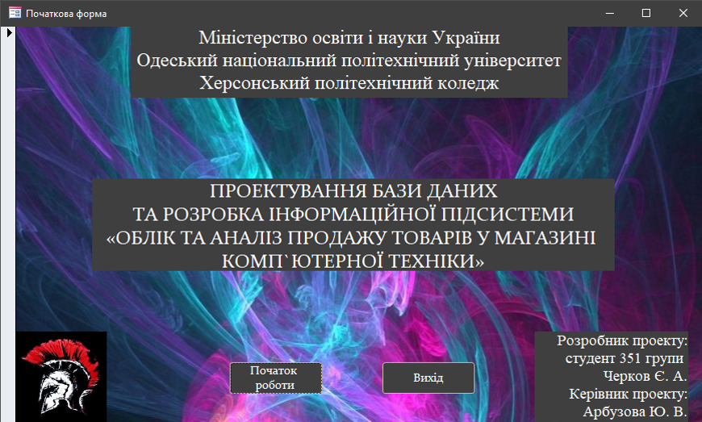
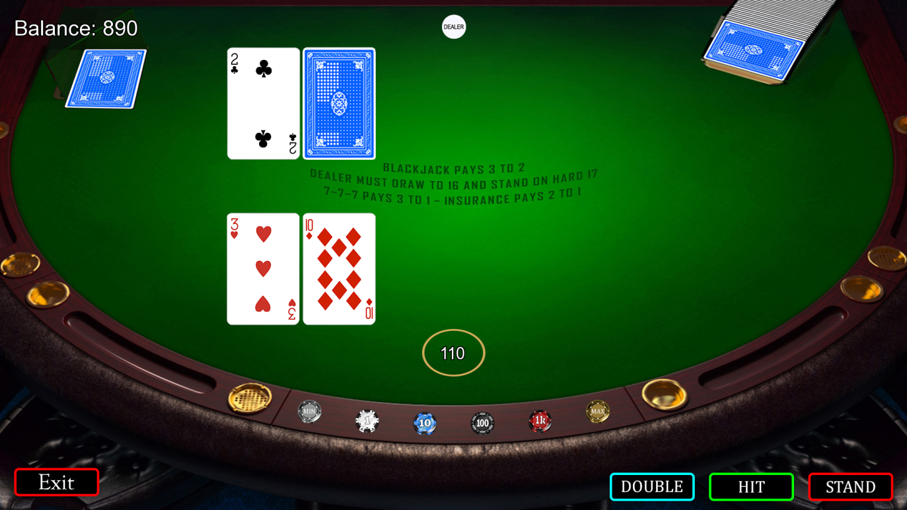
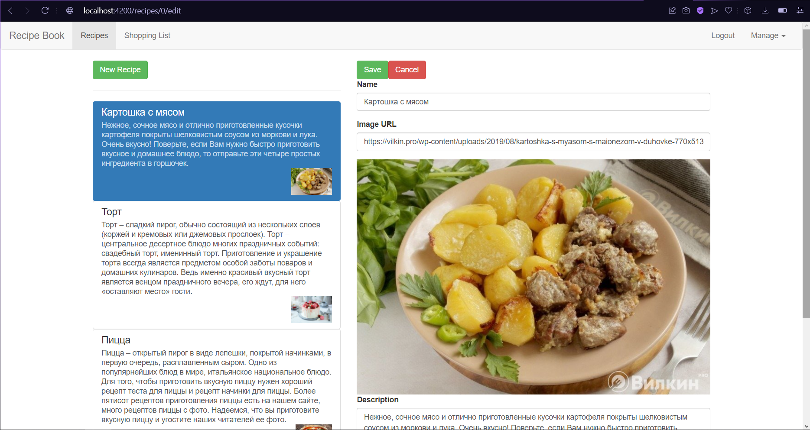
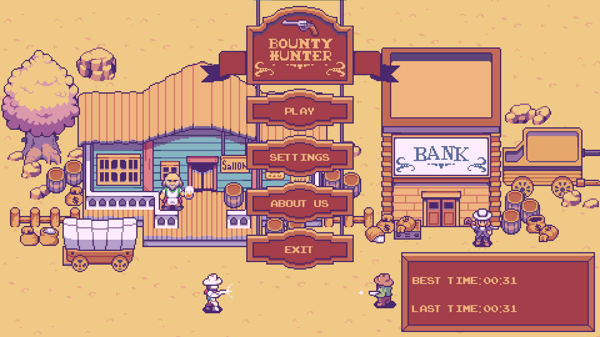
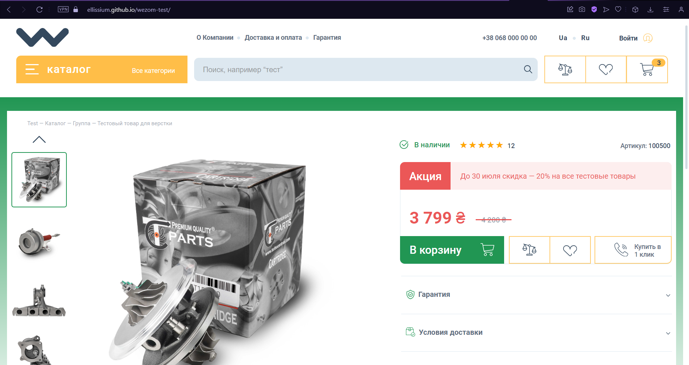
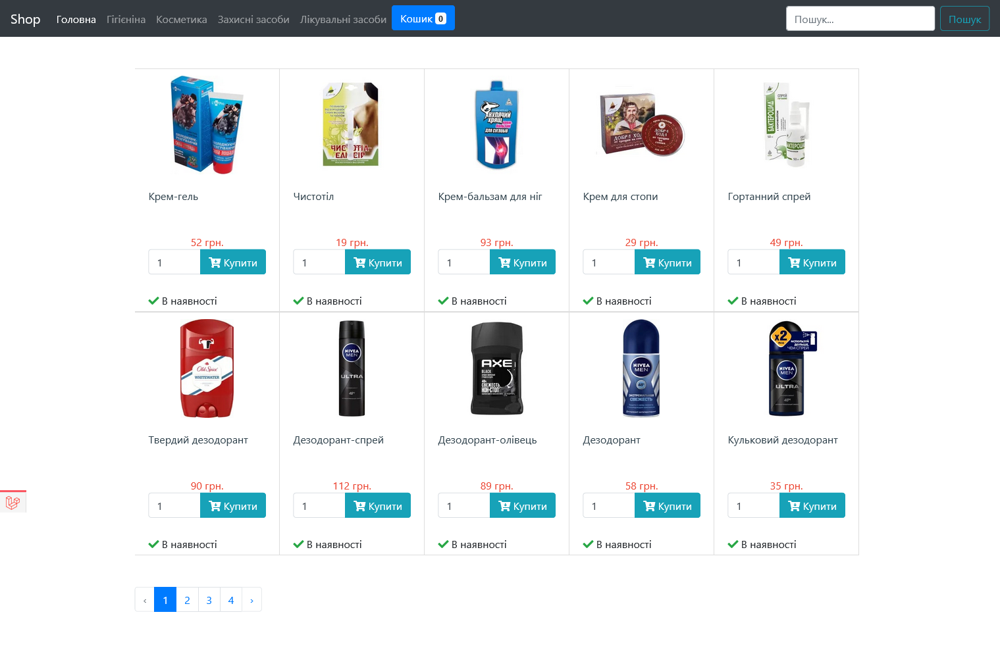
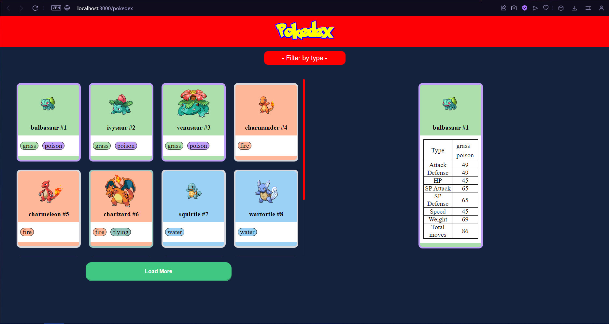
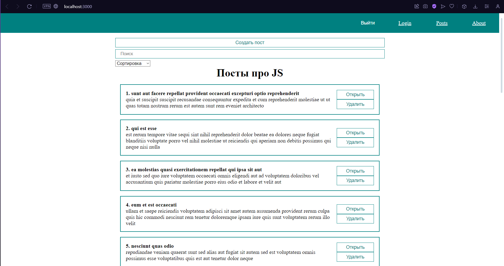
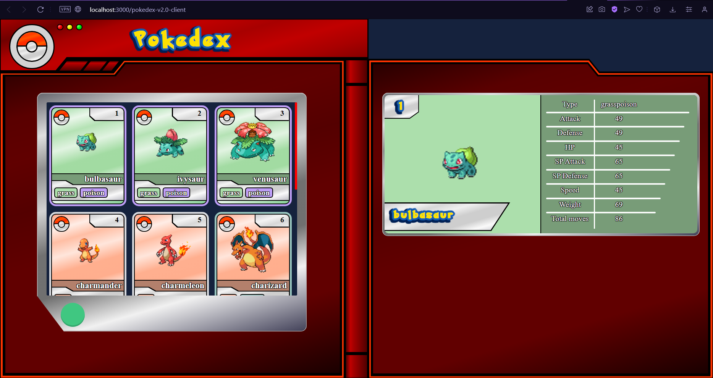
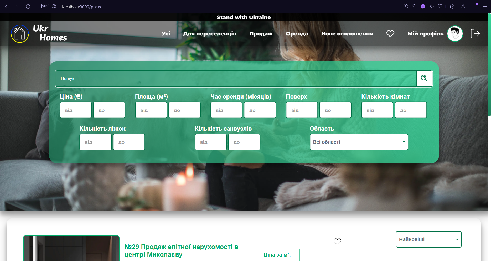

# 🤠 Ellissium

### **`Digital Craftsman (Full Stack Web Developer/Game Developer/Creator)`**

💻 I'm a full-stack developer and content creator. All coding projects are built from the ground up, from planning and designing all the way to solving real-life problems with code.

🎯 I'm a reliable and responsible employee looking for an opportunity to expand my skills and contribute to the success of the company.

📈 Hardworking, ethically detail oriented, trainable, sociable person with a desire to become a professional.

 

#

### 👥 Social media

 

#

### 🏫 Education

📌 Secondary education:

Special school №52. Kherson, Ukraine. September 2008 – May 2017.

 

📌 Specialized secondary education:

Kherson Polytechnic Faculty College Of the State University ‘Odessa Polytechnic’. Kherson, Ukraine. September 2017 – June 2021.

 

📌 Bachelor’s degree:

Kherson National Technical University. Kherson, Ukraine. September 2021 – June 2023.

#

### 📖 Languages

📌 Ukraininan

📌 Russian

📌 English

📌 German

#

### 📚 Programming languages

 

#

### 📦 Technologies

 

#

### 🧰 Tools

 

#

<h3>🖥 Projects</h3>

<a href="#" target="_blank">

WarriorOfSpartaDB

</a>

#

<a href="#" target="_blank">

GameOfRisk

</a>

#

<a href="#" target="_blank">

RecipeBook

</a>

#

<a href="https://github.com/Ellissium/bounty-hunter" target="_blank">

BountyHunter

</a>

#

<a href="https://github.com/Ellissium/wezom-test" target="_blank">

WezomTest

</a>

#

<a href="#" target="_blank">

Cosmetics

</a>

#

<a href="https://github.com/Ellissium/pokedex-v1.0-client" target="_blank">

PokedexV1.0

</a>

#

<a href="https://github.com/Ellissium/react-app-js-training" target="_blank">

Posts

</a>

#

<a href="https://github.com/Ellissium/pokedex-v2.0-client" target="_blank">

PokedexV2.0

</a>

#

<a href="https://github.com/Ellissium/ukr-homes-client" target="_blank">

UkrHomesClient

</a>
<a href="https://github.com/Ellissium/ukr-homes-server" target="_blank">

UkrHomesServer

</a>

#

### 🔥 Statistic

  
  

#

 
<h3>👨‍💻 Ellissium's Coding Journey</h3>

I started my programming journey as a naive student with a passion to learn everything I could about this world of programming. But the start was far from easy. I didn’t know what I wanted, in what direction I should develop my skills, I didn’t know what to study and in what sequence. I made a lot of mistakes and collected information bit by bit. First I created my first database. After that, I decided to develop games and wrote my first game in C++. After that there was a web project in PHP. But I returned to creating games again and, together with my friend, developed another game on the Unity platform. But still, I did not become a game developer. Life's difficulties forced me to change my choices and qualifications. I started focusing on web development. I have written many projects using various frameworks (React, Next, Nest) and improved my skills in many things. Now I'm ready to continue my journey as a web developer and want to create more and more new web applications.

<!--
**Ellissium/Ellissium** is a ✨ _special_ ✨ repository because its `README.md` (this file) appears on your GitHub profile.

Here are some ideas to get you started:

- 🔭 I’m currently working on ...
- 🌱 I’m currently learning ...
- 👯 I’m looking to collaborate on ...
- 🤔 I’m looking for help with ...
- 💬 Ask me about ...
- 📫 How to reach me: ...
- 😄 Pronouns: ...
- ⚡ Fun fact: ...
-->
